# Spring总结

## BeanFactory使用方式

```java
DefaultListableBeanFactory beanFactory = new DefaultListableBeanFactory();
XmlBeanDefinitionReader reader = new XmlBeanDefinitionReader(beanFactory);
reader.loadBeanDefinitions("SpringConfig.xml");
UserService userService = beanFactory.getBean(UserService.class);
```

> Spring最底层的东西

## ApplicationContext使用方式

```java
ApplicationContext ac = new ClassPathXmlApplicationContext("SpringConfig.xml");
UserService userService = ac.getBean(UserService.class);
```

### ApplicationContext实现类

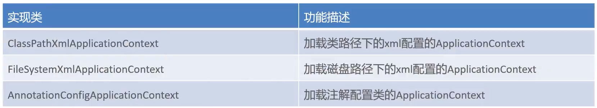

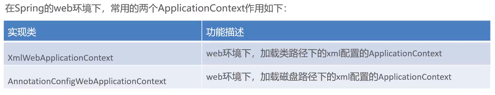

## BeanFactory和ApplicationContext关系（面试题）

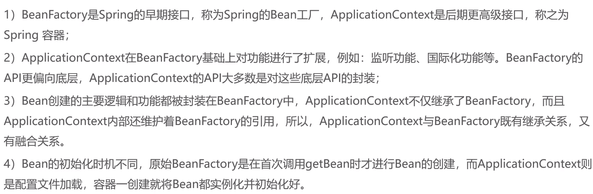

## Bean的基本配置（Xml）

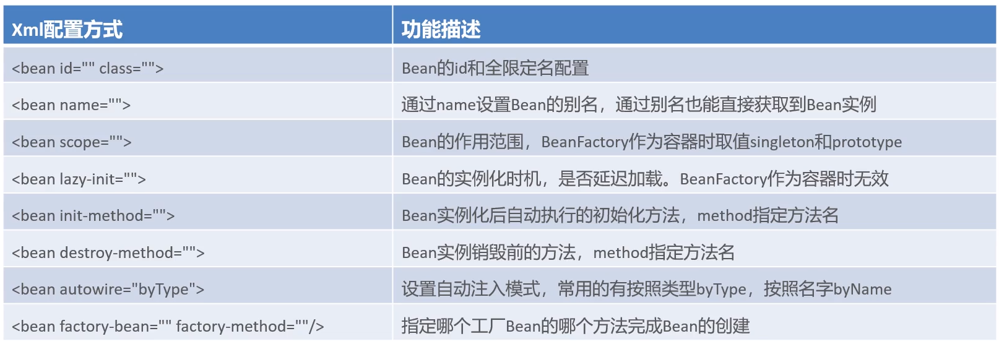

## Bean标签使用

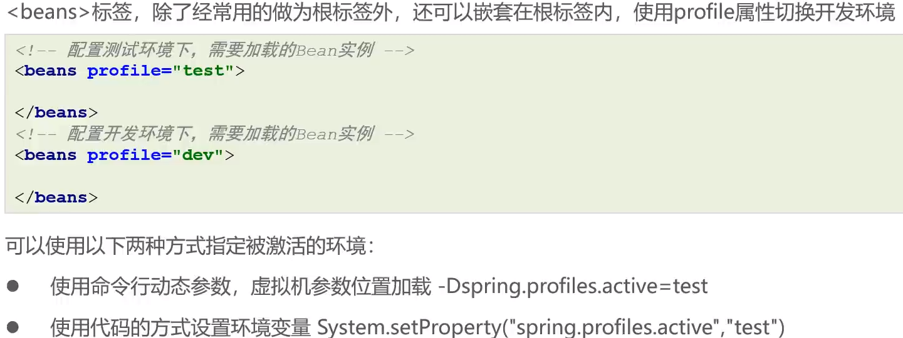

## import标签使用

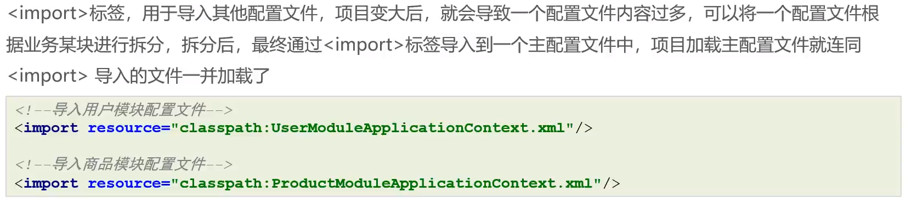

## alias标签使用

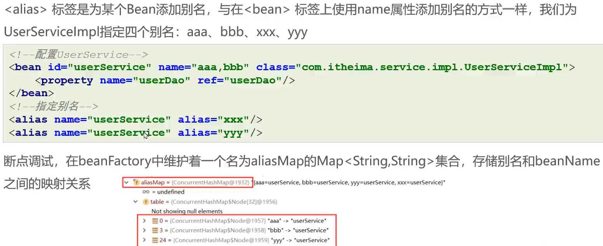

## Spring管理日期

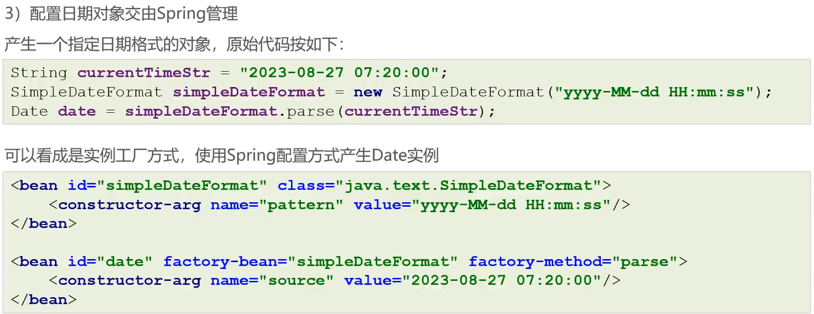

## Bean实例换化流程

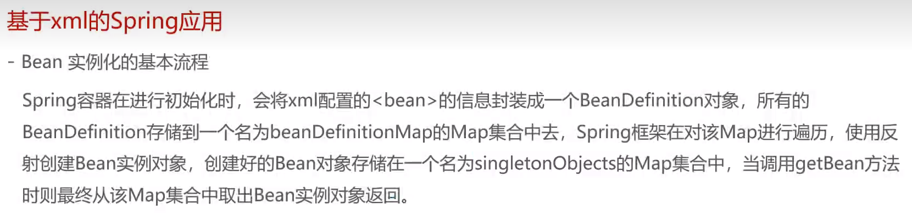

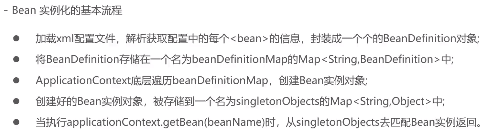

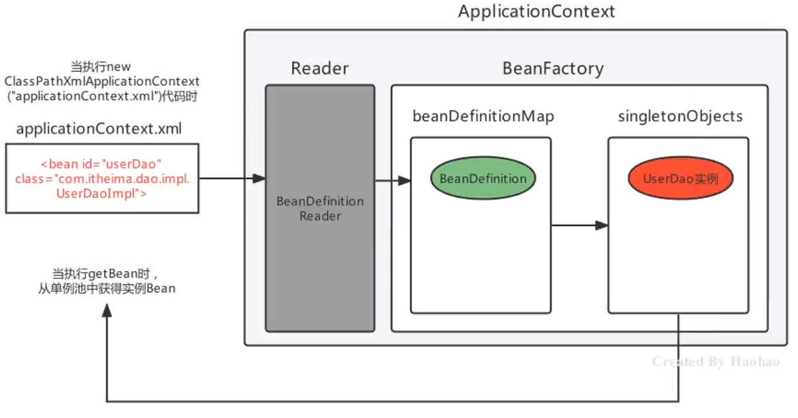

## Spring后处理器

## 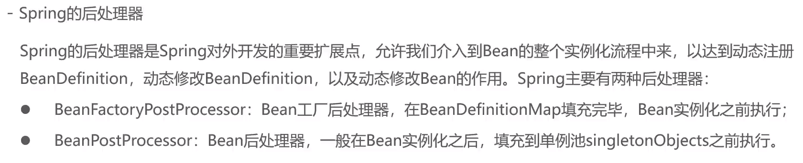Bean工厂后处理器

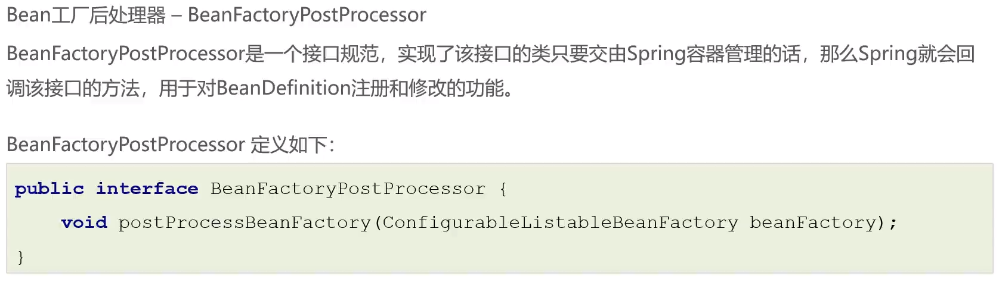

代码

```java
public class MyProcessor implements BeanFactoryPostProcessor {
    @Override
    public void postProcessBeanFactory(ConfigurableListableBeanFactory beanFactory) throws BeansException {
        BeanDefinition beanDefinition = new RootBeanDefinition();
        beanDefinition.setBeanClassName("com.itheima.dao.impl.UserDaoImpl");
        DefaultListableBeanFactory bf = (DefaultListableBeanFactory) beanFactory;
        bf.registerBeanDefinition("userDao",beanDefinition);
        System.out.println("BeanFactoryPostProcessor执行");
     }
}
```

如果需要注册beanDefinition使用以下方法

```java
public class MyProcessor implements BeanDefinitionRegistryPostProcessor {
    @Override
    public void postProcessBeanDefinitionRegistry(BeanDefinitionRegistry registry) throws BeansException {
        BeanDefinition beanDefinition = new RootBeanDefinition();
        beanDefinition.setBeanClassName("com.itheima.dao.impl.UserDaoImpl");
        registry.registerBeanDefinition("userDao",beanDefinition);
        System.out.println("BeanDefinitionRegistryPostProcessor执行");
    }

    @Override
    public void postProcessBeanFactory(ConfigurableListableBeanFactory beanFactory) throws BeansException {

    }
}
```

图示

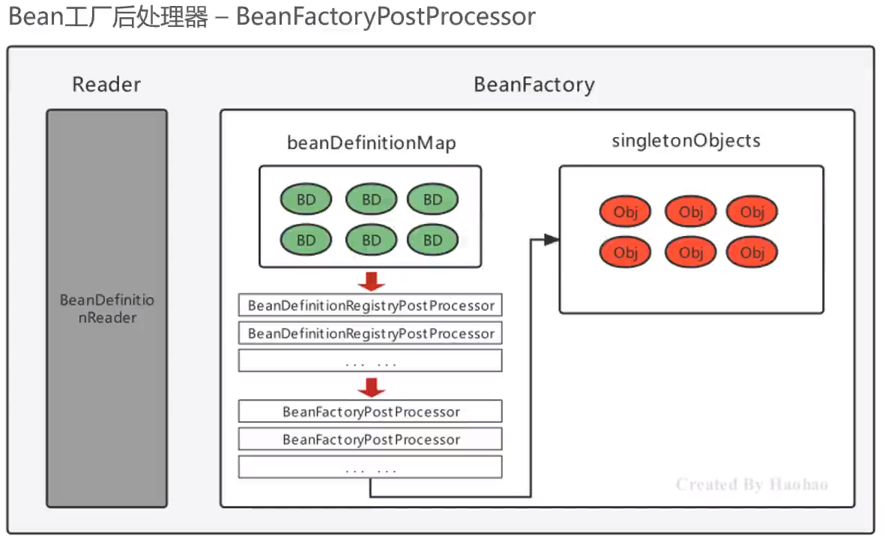

## 注解前置案例（Bean工厂后处理器应用）

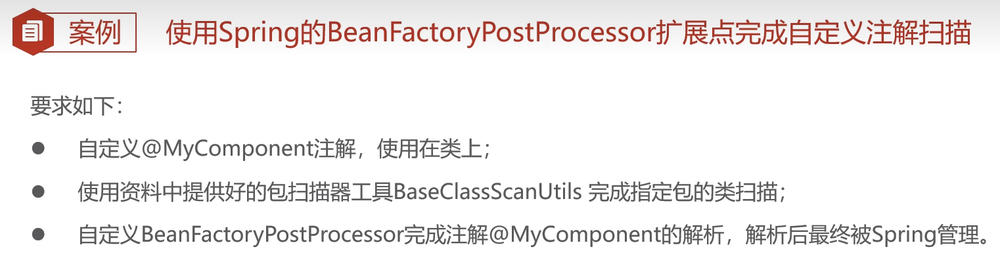

### 1.编写注解

```java
@Target(ElementType.TYPE)
@Retention(RetentionPolicy.RUNTIME)
public @interface MyComponent {
    String value() default "";
}
```

### 2.编写目标Bean

```java
@MyComponent("MyBeans")
public class MyBeans {
}
```

### 3.导入扫描类

```java
public class BaseClassScanUtils {

    //设置资源规则
    private static final String RESOURCE_PATTERN = "/**/*.class";

    public static Map<String, Class> scanMyComponentAnnotation(String basePackage) {

        //创建容器存储使用了指定注解的Bean字节码对象
        Map<String, Class> annotationClassMap = new HashMap<String, Class>();

        //spring工具类，可以获取指定路径下的全部类
        ResourcePatternResolver resourcePatternResolver = new PathMatchingResourcePatternResolver();
        try {
            String pattern = ResourcePatternResolver.CLASSPATH_ALL_URL_PREFIX +
                    ClassUtils.convertClassNameToResourcePath(basePackage) + RESOURCE_PATTERN;
            Resource[] resources = resourcePatternResolver.getResources(pattern);
            //MetadataReader 的工厂类
            MetadataReaderFactory refractory = new CachingMetadataReaderFactory(resourcePatternResolver);
            for (Resource resource : resources) {
                //用于读取类信息
                MetadataReader reader = refractory.getMetadataReader(resource);
                //扫描到的class
                String classname = reader.getClassMetadata().getClassName();
                Class<?> clazz = Class.forName(classname);
                //判断是否属于指定的注解类型
                if(clazz.isAnnotationPresent(MyComponent.class)){
                    //获得注解对象
                    MyComponent annotation = clazz.getAnnotation(MyComponent.class);
                    //获得属value属性值
                    String beanName = annotation.value();
                    //判断是否为""
                    if(beanName!=null&&!beanName.equals("")){
                        //存储到Map中去
                        annotationClassMap.put(beanName,clazz);
                        continue;
                    }

                    //如果没有为"",那就把当前类的类名作为beanName
                    annotationClassMap.put(clazz.getSimpleName(),clazz);

                }
            }
        } catch (Exception exception) {
        }

        return annotationClassMap;
    }

    public static void main(String[] args) {
        Map<String, Class> stringClassMap = scanMyComponentAnnotation("com.itheima");
        System.out.println(stringClassMap);
    }
}
```

### 4.实现Bean工厂后处理器接口

```java
public class MyProcessor implements BeanDefinitionRegistryPostProcessor {
    @Override
    public void postProcessBeanDefinitionRegistry(BeanDefinitionRegistry registry) throws BeansException {

        Map<String, Class> map = BaseClassScanUtils.scanMyComponentAnnotation("com.itheima");
        for (String s : map.keySet()) {
            BeanDefinition beanDefinition = new RootBeanDefinition();
            beanDefinition.setBeanClassName(map.get(s).getName());
            registry.registerBeanDefinition(s,beanDefinition);
        }
    }

    @Override
    public void postProcessBeanFactory(ConfigurableListableBeanFactory beanFactory) throws BeansException {

    }
}
```

### 5.Xml配置后处理器

```xml
<?xml version="1.0" encoding="UTF-8"?>
<beans xmlns="http://www.springframework.org/schema/beans"
       xmlns:xsi="http://www.w3.org/2001/XMLSchema-instance"
       xsi:schemaLocation="http://www.springframework.org/schema/beans http://www.springframework.org/schema/beans/spring-beans.xsd">

    <bean class="com.itheima.processor.MyProcessor"/>
</beans>
```

## Bean后处理器

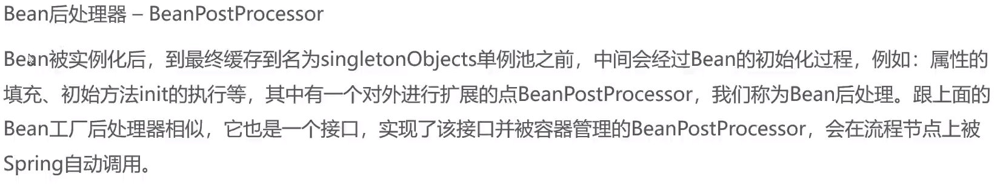

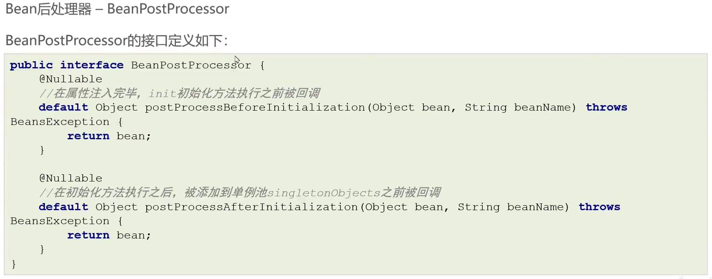

### 入门案例

```java
public class BeanPost implements BeanPostProcessor {
    @Override
    public Object postProcessBeforeInitialization(Object bean, String beanName) throws BeansException {
        if (bean instanceof UserDao){
            UserDaoImpl userDao = (UserDaoImpl) bean;
            userDao.setMoney(100);
        }
        return bean;
    }

    @Override
    public Object postProcessAfterInitialization(Object bean, String beanName) throws BeansException {
        return BeanPostProcessor.super.postProcessAfterInitialization(bean, beanName);
    }
}
```

## InitializingBean使用

> 相当于 init-method

```
public class UserDaoImpl implements UserDao, InitializingBean {
    private int money;

    public UserDaoImpl(){
        System.out.println("构造器");
    }

    public void setMoney(int money) {
        System.out.println("setter");
        this.money = money;
    }

    @Override
    public void save() {
        System.out.println(money);
    }

    public void init(){
        System.out.println("init");
    }

    @Override
    public void afterPropertiesSet() throws Exception {
        System.out.println("afterPropertiesSet");
    }
}
```

