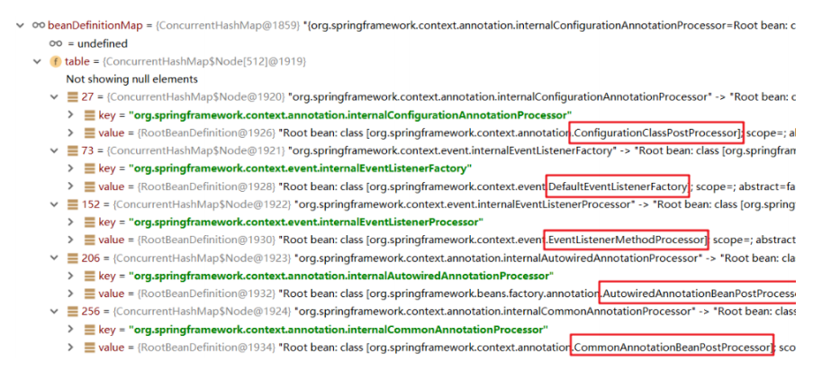

# Spring总结


## 基于注解的Spring应用

### Bean基本注解开发

Spring除了xml配置文件进行配置之外，还可以使用注解方式进行配置，注解方式慢慢成为xml配置的替代方案。我 们有了xml开发的经验，学习注解开发就方便了许多，注解开发更加快捷方便。 

**Spring提供的注解有三个版本：**  

- 2.0时代，Spring开始出现注解 

- 2.5时代，Spring的Bean配置可以使用注解完成 

- 3.0时代，Spring其他配置也可以使用注解完成，我们进入全注解时代

**基本Bean注解，主要是使用注解的方式替代原有xml的  标签及其标签属性的配置** 

```xml
<bean id="" name="" class="" scope="" lazy-init="" init-method="" destroy-method="" 
abstract="" autowire="" factory-bean="" factory-method=""></bean>
```

使用@Component 注解替代标签

| xml配置                  | 注解       | 描述                                                     |
| ------------------------ | ---------- | -------------------------------------------------------- |
| ` <bean id="" class="">` | @Component | 被该注解标识的类，会在指定扫描范围内被Spring加载并实例化 |

可以通过@Component注解的value属性指定当前Bean实例的beanName，也可以省略不写，不写的情况下为当前类名首字母小写

```java
//获取方式：applicationContext.getBean("userDao");
@Component("userDao")
public class UserDaoImpl implements UserDao {
}
//获取方式：applicationContext.getBean("userDaoImpl");
@Component
public class UserDaoImpl implements UserDao {
}
```

使用注解对需要被Spring实例化的Bean进行标注，但是需要告诉Spring去哪找这些Bean，要配置组件扫描路径

```xml
<?xml version="1.0" encoding="UTF-8"?>
<beans xmlns="http://www.springframework.org/schema/beans"
xmlns:xsi="http://www.w3.org/2001/xmlSchema-instance"
xmlns:context="http://www.springframework.org/schema/context"
xsi:schemaLocation="
http://www.springframework.org/schema/beans 
http://www.springframework.org/schema/beans/spring-beans.xsd
http://www.springframework.org/schema/context 
http://www.springframework.org/schema/context/spring-context.xsd
">
<!-- 告知Spring框架去itheima包及其子包下去扫描使用了注解的类 -->
<context:component-scan base-package="com.itheima"/>
</beans>
```

@Component就单纯一个value属性，那么xml配置 `<bean>` 时那些属性怎么进行配置呢？Spring 是通过注解方式去配置的之前 `<bean>` 标签中的那些属性，例如：@Scope

使用@Component 注解替代`<bean>` 标签

| xml配置                    | 注解           | 描述                                                         |
| -------------------------- | -------------- | ------------------------------------------------------------ |
| `<bean scope="">`          | @Scope         | 在类上或使用了@Bean标注的方法上，标注Bean的作用范围，取值为singleton或prototype |
| `<bean lazy-init="">`      | @Lazy          | 在类上或使用了@Bean标注的方法上，标注Bean是否延迟加载，取值为true和false |
| `<bean init-method="">`    | @PostConstruct | 在方法上使用，标注Bean的实例化后执行的方法                   |
| `<bean destroy-method="">` | @PreDestroy    | 在方法上使用，标注Bean的销毁前执行方法                       |

使用上述注解完成UserDaoImpl的基本配置

```java
@Component("userDao")
@Scope("singleton")
@Lazy(true)
public class UserDaoImpl implements UserDao{
    @PostConstruct
    public void init(){}
    @PreDestroy
    public void destroy(){}
}
```

由于JavaEE开发是分层的，为了每层Bean标识的注解语义化更加明确，@Component又衍生出如下三个注解：

| @Component衍生注解 | 描述                |
| ------------------ | ------------------- |
| @Repository        | 在Dao层类上使用     |
| @Service           | 在Service层类上使用 |
| @Controller        | 在Web层类上使用     |

```java
@Repository("userDao")
public class UserDaoImpl implements UserDao{}

@Service("userService")
public class UserServiceImpl implements UserService{}

@Controller("userService")
public class UserController {}
```

### Bean依赖注入注解开发

Bean依赖注入的注解，主要是使用注解的方式替代xml的 `<property>` 标签完成属性的注入操作

```xml
<bean id="" class="">
    <property name="" value=""/>
    <property name="" ref=""/>
</bean>
```

Spring主要提供如下注解，用于在Bean内部进行属性注入的：

| 属性注入注解 | 描述                                                   |
| ------------ | ------------------------------------------------------ |
| @Value       | 使用在字段或方法上，用于注入普通数据                   |
| @Autowired   | 使用在字段或方法上，用于根据类型（byType）注入引用数据 |
| @Qualifier   | 使用在字段或方法上，结合@Autowired，根据名称注入       |
| @Resource    | 使用在字段或方法上，根据类型或名称进行注入             |

通过@Value 直接注入普通属性

```java
@Value("haohao")
private String username;

@Value("haohao")
public void setUsername(String username){
	System.out.println(username);
}
```

通过@Value 注入properties文件中的属性

```
@Value("${jdbc.username}")
private String username;

@Value("${jdbc.username}")
public void setUsername(String username){
	System.out.println(username);
}
```

加载properties文件

```xml
<context:property-placeholder location="classpath:jdbc.properties"/>
```

@Autowired注解，用于根据类型进行注入

```java
//使用在属性上直接注入
@Autowired
private UserDao userDao;

//使用在方法上直接注入
@Autowired
public void setUserDao(UserDao userDao){
	System.out.println(userDao);
}
```

当容器中同一类型的Bean实例有多个时，会尝试自动根据名字进行匹配：

```java
//匹配当前Bean
@Repository("userDao")
public class UserDaoImpl implements UserDao{}

@Repository("userDao2")
public class UserDaoImpl2 implements UserDao{}
```

当容器中同一类型的Bean实例有多个时，且名字与被注入Bean名称不匹配时会报错

@Qualifier配合@Autowired可以完成根据名称注入Bean实例，使用@Qualifier指定名称

```java
@Autowired
@Qualifier("userDao2")
private UserDao userDao;

@Autowired
@Qualifier("userDao2")
public void setUserDao(UserDao userDao){
	System.out.println(userDao);
}
```

@Resource注解既可以根据类型注入，也可以根据名称注入，无参就是根据类型注入，有参数就是根据名称注入

```java
@Resource
private UserDao userDao;

@Resource(name = "userDao2")
public void setUserDao(UserDao userDao){
	System.out.println(userDao);
}
```

PS：@Resource注解存在与 javax.annotation 包中，Spring对其进行了解析

### 非自定义Bean注解开发

非自定义Bean不能像自定义Bean一样使用@Component进行管理，非自定义Bean要通过工厂的方式进行实例化，使用@Bean标注方法即可，@Bean的属性为beanName，如不指定为当前工厂方法名称

```java
//将方法返回值Bean实例以@Bean注解指定的名称存储到Spring容器中
@Bean("dataSource")
public DataSource dataSource(){
	DruidDataSource dataSource = new DruidDataSource();
    dataSource.setDriverClassName("com.mysql.jdbc.Driver");
    dataSource.setUrl("jdbc:mysql://localhost:3306/mybatis");
    dataSource.setUsername("root");
    dataSource.setPassword("root");
    return dataSource;
}
```

PS：工厂方法所在类必须要被Spring管理

如果@Bean工厂方法需要参数的话，则有如下几种注入方式：

-  使用@Autowired 根据类型自动进行Bean的匹配，@Autowired可以省略 ；
-  使用@Qualifier 根据名称进行Bean的匹配；
-  使用@Value 根据名称进行普通数据类型匹配。

```java
@Bean
@Autowired //根据类型匹配参数
public Object objectDemo01(UserDao userDao){
    System.out.println(userDao);
    return new Object();
}
@Bean
public Object objectDemo02(@Qualifier("userDao") UserDao userDao,
                           @Value("${jdbc.username}") String username){
    System.out.println(userDao);
    System.out.println(username);
    return new Object();
}
```

### Bean配置类的注解开发

@Component等注解替代了`<bean>`标签，但是像`<import>`、`<context:componentScan>` 等非`<bean> `标签怎样去使用注解替代呢？

```xml
<!-- 加载properties文件 -->
<context:property-placeholder location="classpath:jdbc.properties"/>
<!-- 组件扫描 -->
<context:component-scan base-package="com.itheima"/>
<!-- 引入其他xml文件 -->
<import resource="classpath:beans.xml"/>
```

定义一个配置类替代原有的xml配置文件，`<bean>`标签以外的标签，一般都是在配置类上使用注解完成的

@Configuration注解标识的类为配置类，替代原有xml配置文件，该注解第一个作用是标识该类是一个配置类，第
二个作用是具备@Component作用

```java
@Configuration
public class ApplicationContextConfig {}
```

@ComponentScan 组件扫描配置，替代原有xml文件中的`<context:component-scan base-package=""/>`

```java
@Configuration
@ComponentScan({"com.itheima.service","com.itheima.dao"})
public class ApplicationContextConfig {}
```

base-package的配置方式：

- 指定一个或多个包名：扫描指定包及其子包下使用注解的类
- 不配置包名：扫描当前@componentScan注解配置类所在包及其子包下的类

@PropertySource 注解用于加载外部properties资源配置，替代原有xml中的 `<context:propertyplaceholder location=“”/>` 配置

```java
@Configuration
@ComponentScan
@PropertySource({"classpath:jdbc.properties","classpath:xxx.properties"})
public class ApplicationContextConfig {}
```

@Import 用于加载其他配置类，替代原有xml中的`<import resource="classpath:beans.xml"/>`配置

```java
@Configuration
@ComponentScan
@PropertySource("classpath:jdbc.properties")
@Import(OtherConfig.class)
public class ApplicationContextConfig {}
```

### Spring 配置其他注解

扩展：@Primary注解用于标注相同类型的Bean优先被使用权，@Primary 是Spring3.0引入的，与@Component
和@Bean一起使用，标注该Bean的优先级更高，则在通过类型获取Bean或通过@Autowired根据类型进行注入时，
会选用优先级更高的

```java
@Repository("userDao")
public class UserDaoImpl implements UserDao{}
@Repository("userDao2")
@Primary
public class UserDaoImpl2 implements UserDao{}
```

```java
@Bean
public UserDao userDao01(){return new UserDaoImpl();}
@Bean
@Primary
public UserDao userDao02(){return new UserDaoImpl2();}
```

扩展：@Profile 注解的作用同于xml配置时学习profile属性，是进行环境切换使用的

```xml
<beans profile="test">
```

注解 @Profile 标注在类或方法上，标注当前产生的Bean从属于哪个环境，只有激活了当前环境，被标注的Bean才能被注册到Spring容器里，不指定环境的Bean，任何环境下都能注册到Spring容器里

```java
@Repository("userDao")
@Profile("test")
public class UserDaoImpl implements UserDao{}
@Repository("userDao2")
public class UserDaoImpl2 implements UserDao{}
```

可以使用以下两种方式指定被激活的环境：

- 使用命令行动态参数，虚拟机参数位置加载 -Dspring.profiles.active=test
- 使用代码的方式设置环境变量 System.setProperty("spring.profiles.active","test");

### *Spring注解的解析原理


使用@Component等注解配置完毕后，要配置组件扫描才能使注解生效

- xml配置组件扫描：

```xml
<context:component-scan base-package="com.itheima"/>
```

- 配置类配置组件扫描：

```java
@Configuration
@ComponentScan("com.itheima")
public class AppConfig {
}
```

使用xml方式配置组件扫描，而component-scan是一个context命名空间下的自定义标签，所以要找到对应的命名空间处理器NamespaceHandler 和 解析器，查看spring-context包下的spring.handlers文件

```
http\://www.springframework.org/schema/context=org.springframework.context.config.ContextNamespaceHandler
```

查看 ContextNamespaceHandler 类

```java
public void init() {
	this.registerBeanDefinitionParser("component-scan", 
                                      new ComponentScanBeanDefinitionParser());
}
```

将ComponentScanBeanDefinitionParser进行了注册，对其源码进行跟踪，最终将标注的@Component的类，生成对应的BeanDefiition进行了注册

使用配置类配置组件扫描，使用AnnotationConfigApplicationContext容器在进行创建时，内部调用了如下代码，该工具注册了几个Bean后处理器：

```java
AnnotationConfigUtils.registerAnnotationConfigProcessors(this.registry);
```



其中，ConfigurationClassPostProcessor 是 一个 BeanDefinitionRegistryPostProcessor ，经过一系列源码调用，最终也别指定到了 ClassPathBeanDefinitionScanner 的 doScan 方法（与xml方式最终终点一致）


### Spring注解方式整合第三方框架

第三方框架整合，依然使用MyBatis作为整合对象，之前我们已经使用xml方式整合了MyBatis，现在使用注解方式无非就是将xml标签替换为注解，将xml配置文件替换为配置类而已，原有xml方式整合配置如下：

```xml
<!--配置数据源-->
<bean id="dataSource" class="com.alibaba.druid.pool.DruidDataSource">
    <property name="url" value="jdbc:mysql://localhost:3306/mybatis"></property>
    <property name="username" value="root"></property>
    <property name="password" value="root"></property>
</bean>
<!--配置SqlSessionFactoryBean-->
<bean class="org.mybatis.spring.SqlSessionFactoryBean">
    <property name="dataSource" ref="dataSource"></property>
</bean>
<!--配置Mapper包扫描-->
<bean class="org.mybatis.spring.mapper.MapperScannerConfigurer">
    <property name="basePackage" value="com.itheima.dao"></property>
</bean>
```

使用@Bean将DataSource和SqlSessionFactoryBean存储到Spring容器中，而MapperScannerConfigurer使用注解@MapperScan进行指明需要扫描的Mapper在哪个包下，使用注解整合MyBatis配置方式如下：

```java
@Configuration
@ComponentScan("com.itheima")
@MapperScan("com.itheima.mapper")
public class ApplicationContextConfig {
    @Bean
    public DataSource dataSource(){
        DruidDataSource dataSource = new DruidDataSource();
        //省略部分代码
        return dataSource;}
    @Bean
    public SqlSessionFactoryBean sqlSessionFactoryBean(DataSource dataSource){
        SqlSessionFactoryBean sqlSessionFactoryBean = new SqlSessionFactoryBean();
        sqlSessionFactoryBean.setDataSource(dataSource);
        return sqlSessionFactoryBean;
    }}
```

注解方式，Spring整合MyBatis的原理，关键在于@MapperScan，@MapperScan不是Spring提供的注解，是
MyBatis为了整合Spring，在整合包org.mybatis.spring.annotation中提供的注解，源码如下：

```java
@Retention(RetentionPolicy.RUNTIME)
@Target({ElementType.TYPE})
@Documented
@Import({MapperScannerRegistrar.class})
@Repeatable(MapperScans.class)
public @interface MapperScan {
    String[] value() default {};
    String[] basePackages() default {};
    Class<?>[] basePackageClasses() default {};
    Class<? extends Annotation> annotationClass() default Annotation.class;
    // ... ...
}
```

重点关注一下@Import({MapperScannerRegistrar.class})，当@MapperScan被扫描加载时，会解析@Import注解，从而加载指定的类，此处就是加载了MapperScannerRegistrar

MapperScannerRegistrar实现了ImportBeanDefinitionRegistrar接口，Spring会自动调用registerBeanDefinitions方法，该方法中又注册MapperScannerConfigurer类，而MapperScannerConfigurer类作用是扫描Mapper，向容器中注册Mapper对应的MapperFactoryBean，前面讲过，此处不在赘述了：

```java
public class MapperScannerRegistrar implements ImportBeanDefinitionRegistrar,
ResourceLoaderAware {
    //默认执行registerBeanDefinitions方法
    void registerBeanDefinitions(AnnotationMetadata annoMeta, AnnotationAttributes annoAttrs,
                                 BeanDefinitionRegistry registry, String beanName) {
        BeanDefinitionBuilder builder =
            BeanDefinitionBuilder.genericBeanDefinition(MapperScannerConfigurer.class);
        //... 省略其他代码 ...
        //注册BeanDefinition
        registry.registerBeanDefinition(beanName, builder.getBeanDefinition());
    }
}
```

Spring与MyBatis注解方式整合有个重要的技术点就是@Import，第三方框架与Spring整合xml方式很多是凭借自
定义标签完成的，而第三方框架与Spring整合注解方式很多是靠@Import注解完成的。

@Import可以导入如下三种类：

-  普通的配置类
-  实现ImportSelector接口的类
-  实现ImportBeanDefinitionRegistrar接口的类

@Import导入实现了ImportSelector接口的类

```java
@Configuration
@ComponentScan("com.itheima")
@Import({MyImportSelector.class})
public class ApplicationContextConfig {
    
}
```

```java
public class MyImportSelector implements ImportSelector {
    @Override
    public String[] selectImports(AnnotationMetadata annotationMetadata) {
        //返回要进行注册的Bean的全限定名数组
        return new String[]{User2.class.getName()};
    }
}
```

ImportSelector接口selectImports方法的参数AnnotationMetadata代表注解的媒体数据，可以获得当前注解修饰的类的元信息，例如：获得组件扫描的包名

```java
public class MyImportSelector implements ImportSelector {
    @Override
    public String[] selectImports(AnnotationMetadata annotationMetadata) {
        //获得指定类型注解的全部信息
        Map<String, Object> annotationAttributes =
            annotationMetadata.getAnnotationAttributes(ComponentScan.class.getName());
        //获得全部信息中basePackages信息
        String[] basePackages = (String[]) annotationAttributes.get("basePackages");
        //打印结果是com.itheima
        System.out.println(basePackages[0]);
        return new String[]{User2.class.getName()};
    }
}
```

@Import导入实现ImportBeanDefinitionRegistrar接口的类，实现了该接口的类的registerBeanDefinitions方法会被自动调用，在该方法内可以注册BeanDefinition

```java
public class MyImportBeanDefinitionRegistrar implements ImportBeanDefinitionRegistrar {
    @Override
    public void registerBeanDefinitions(AnnotationMetadata importingClassMetadata,
                                        BeanDefinitionRegistry registry) {
        //使用给定的BeanDefinitionRegistry参数，手动注册BeanDefinition
        BeanDefinition beanDefinition = new RootBeanDefinition();
        beanDefinition.setBeanClassName("com.itheima.pojo.User2");
        registry.registerBeanDefinition("user2",beanDefinition);
    }
}
```

## AOP

### AOP 简介

AOP，Aspect Oriented Programming，面向切面编程，是对面向对象编程OOP的升华。OOP是纵向对一个 事物的抽象，一个对象包括静态的属性信息，包括动态的方法信息等。而AOP是横向的对不同事物的抽象，属 性与属性、方法与方法、对象与对象都可以组成一个切面，而用这种思维去设计编程的方式叫做面向切面编程
