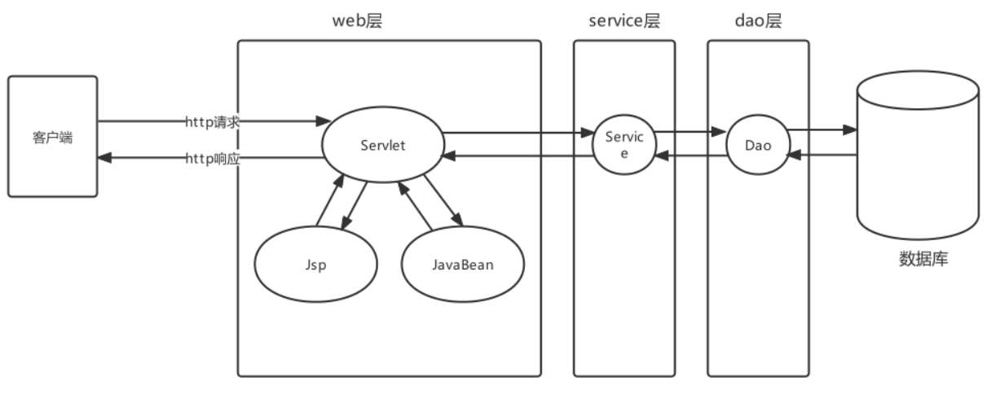
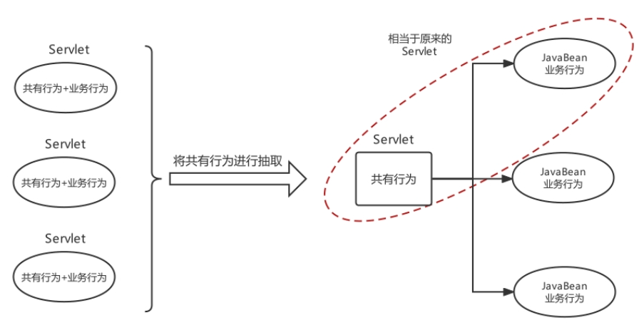
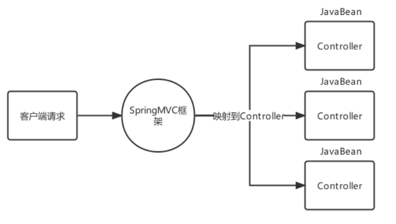
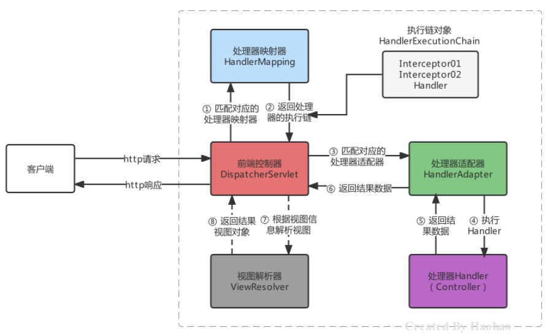
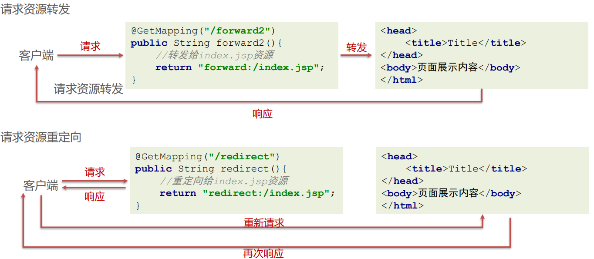
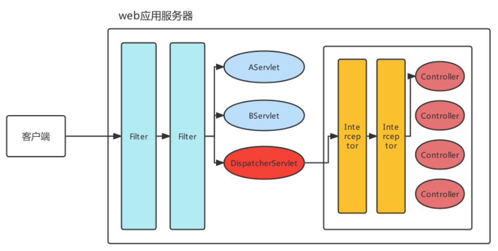
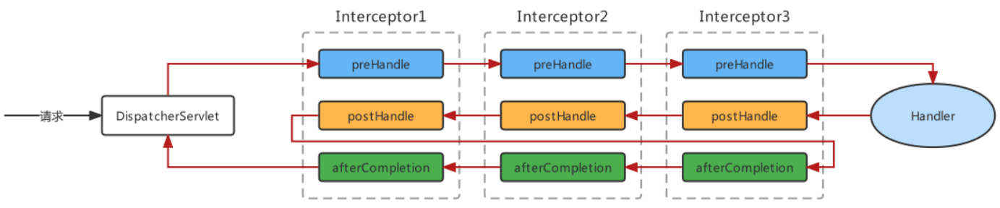
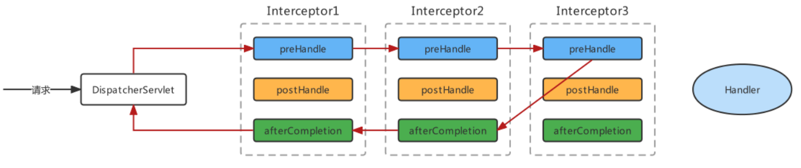
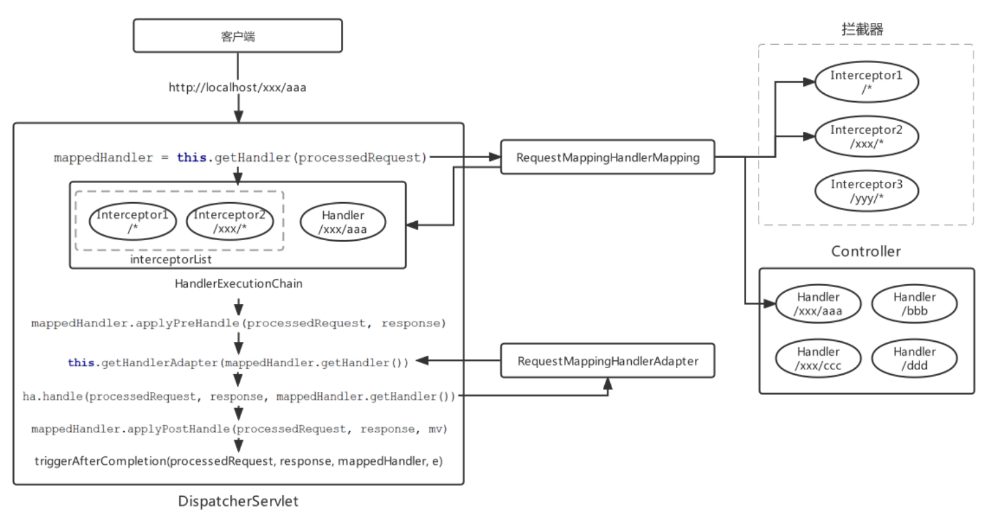

# javaSpring MVC

## Spring整合web环境

### Javaweb三大组件及环境特点

在Java语言范畴内，web层框架都是基于Javaweb基础组件完成的，所以有必要复习一下Javaweb组件的特点

| 组件     | 作用                                            | 特点                                                         |
| -------- | ----------------------------------------------- | ------------------------------------------------------------ |
| Servlet  | 服务端小程序，负责接收客户端 请求并作出响应的   | 单例对象，默认第一次访问创建，可以通过配置指定服务器启动就创建，Servlet 创建完毕会执行初始化init方法。每个Servlet有一个service方法，每次访问都会 执行service方法，但是缺点是一个业务功能就需要配置一个Servlet |
| Filter   | 过滤器，负责对客户端请求进行 过滤操作的         | 单例对象，服务器启动时就创建，对象创建完毕执行init方法，对客户端的请求 进行过滤，符合要求的放行，不符合要求的直接响应客户端，执行过滤的核心 方法doFilter |
| Listener | 监听器，负责对域对象的创建和 属性变化进行监听的 | 根据类型和作用不同，又可分为监听域对象创建销毁和域对象属性内容变化的， 根据监听的域不同，又可以分为监听Request域的，监听Session域的，监听 ServletContext域的 |

### Spring整合web环境的思路及实现

在进行Java开发时要遵循三层架构+MVC，Spring操作最核心的就是Spring容器，web层需要注入Service， service层需要注入Dao（Mapper），web层使用Servlet技术充当的话，需要在Servlet中获得Spring容器

```java
AnnotationConfigApplicationContext applicationContext = new AnnotationConfigApplicationContext(ApplicationContextConfig.class);
AccountService accountService = (AccountService)applicationContext.getBean("accountService");
accountService.transferMoney("tom","lucy",100);
```

web层代码如果都去编写创建AnnotationConfigApplicationContext的代码，那么配置类重复被加载了， Spring容器也重复被创建了，不能每次想从容器中获得一个Bean都得先创建一次容器，这样肯定是不允许。 所以，我们现在的诉求很简单，如下：

- ApplicationContext创建一次，配置类加载一次; 
- 最好web服务器启动时，就执行第1步操作，后续直接从容器中获取Bean使用即可; 
- ApplicationContext的引用需要在web层任何位置都可以获取到

针对以上诉求我们给出解决思路，如下： 

- 在ServletContextListener的contextInitialized方法中执行ApplicationContext的创建。或在Servlet的init 方法中执行ApplicationContext的创建，并给Servlet的load-on-startup属性一个数字值，确保服务器启动 Servlet就创建; 
- 将创建好的ApplicationContext存储到ServletContext域中，这样整个web层任何位置就都可以获取到了

**代码如下** 

编写ContextLoadListener用于在tomcat启动时将ioc容器放入ServletContext域中

```java
public class ContextLoaderListener implements ServletContextListener {
    @Override
    public void contextInitialized(ServletContextEvent sce) {
        //1.创建Spring容器
        ApplicationContext app = new ClassPathXmlApplicationContext("spring-config.xml");
        //2.将容器放入域中
        sce.getServletContext().setAttribute("ApplicationContext", app);
    }
}
```

配置web.xml设置监听器

```xml
<listener>
    <listener-class>org.eu.themoss.listener.ContextLoaderListener</listener-class>
</listener>
```

在servlet中使用容器获取对应Bean

```java
@WebServlet("/hello")
public class hello extends HttpServlet {
    @Override
    protected void service(HttpServletRequest req, HttpServletResponse resp) throws ServletException, IOException {
        ApplicationContext applicationContext = (ApplicationContext) req.getServletContext().getAttribute("ApplicationContext");
        UserService bean = applicationContext.getBean(UserService.class);
        System.out.println(bean);
    }
}
```

tip: ServletContext获取对应初始化参数

```xml
<context-param>
    <param-name>contextConfigLocation</param-name>
    <param-value>classpath:spring-config.xml</param-value>
</context-param>
```

```java
String ServletContext.getInitParameter("contextConfigLocation");
```

###  Spring的web开发组件spring-web

到此，就将一开始的诉求都解决了，当然我们能想到的Spring 框架自然也会想到，Spring其实已经为我们定义 好了一个ContextLoaderListener，使用方式跟我们上面自己定义的大体一样，但是功能要比我们强百倍，所以 ，遵循Spring "拿来主义" 的精神，我们直接使用Spring提供的就可以了，开发如下： 

先导入Spring-web的坐标：

```xml
<dependency>
    <groupId>org.springframework</groupId>
    <artifactId>spring-context</artifactId>
    <version>5.3.27</version>
</dependency>
```

在web.xml中去配置ContextLoaderListener，并指定配置文件的位置

```
<context-param>
    <param-name>contextConfigLocation</param-name>
    <param-value>classpath:spring-config.xml</param-value>
</context-param>
<listener>
    <listener-class>org.springframework.web.context.ContextLoaderListener</listener-class>
</listener>
```

在Servlet中直接使用

```java
@WebServlet("/hello")
public class hello extends HttpServlet {
    @Override
    protected void service(HttpServletRequest req, HttpServletResponse resp) throws ServletException, IOException {
        WebApplicationContext webApplicationContext = WebApplicationContextUtils.getWebApplicationContext(req.getServletContext());
        UserService userService = webApplicationContext.getBean(UserService.class);
        System.out.println(userService);
    }
}
```

**和自己手写思路差不多** 


如果核心配置类使用的是注解形式的，那么Spring容器是AnnotationConfigWebApplicationContext，如下配置方式

```java
public class MyAnnotationConfigWebApplicationContext extends AnnotationConfigWebApplicationContext {
    public MyAnnotationConfigWebApplicationContext() {
        //注册配置类
        super.register(ApplicationContextConfig.class);
    }
}
```

```xml
<context-param>
    <param-name>contextClass</param-name>
    <param-value>org.eu.themoss.config.MyAnnotationConfigWebApplicationContext</param-value>
</context-param>
<listener>
    <listener-class>org.springframework.web.context.ContextLoaderListener</listener-class>
</listener>
```

## web层MVC框架思想与设计思路

### MVC框架思想及其设计思路

Java程序员在开发一般都是MVC+三层架构，MVC是web开发模式，传统的Javaweb技术栈实现的MVC如下



原始Javaweb开发中，Servlet充当Controller的角色，Jsp充当View角色，JavaBean充当模型角色，后期Ajax异 步流行后，在加上现在前后端分离开发模式成熟后，View就被原始Html+Vue替代。原始Javaweb开发中， Service充当Controller有很多弊端，显而易见的有如下几个：

| Servlet作为Controller的问题                                  | 解决思路和方案                                               |
| ------------------------------------------------------------ | ------------------------------------------------------------ |
| 每个业务功能请求都对应一个Servlet                            | 根据业务模块去划分Controller                                 |
| 每个Servlet的业务操作太繁琐                                  | 将通用的行为，功能进行抽取封装                               |
| Servlet获得Spring容器的组件只能通过客户端代码去获取，不能 优雅的整合 | 通过Spring的扩展点，去封装一个框架，从原有的Servlet完全接 手过来web层的业务 |

负责共有行为的Servlet称之为前端控制器，负责业务行为的JavaBean称之为控制器Controller



分析前端控制器基本功能如下： 

1、具备可以映射到业务Bean的能力 

2、具备可以解析请求参数、封装实体等共有功能 

3、具备响应视图及响应其他数据的功能

## SpringMVC简介

###  SpringMVC概述

SpringMVC是一个基于Spring开发的MVC轻量级框架，Spring3.0后发布的组件，SpringMVC和Spring可以无 缝整合，使用DispatcherServlet作为前端控制器，且内部提供了处理器映射器、处理器适配器、视图解析器等组 件，可以简化JavaBean封装，Json转化、文件上传等操作。



### SpringMVC快速入门

导入Spring整合SpringMVC的坐标

```xml
<dependency>
    <groupId>org.springframework</groupId>
    <artifactId>spring-webmvc</artifactId>
    <version>5.3.27</version>
</dependency>
```

编写一个控制器Controller，配置映射信息

```java
@Controller
public class UserController {

    @RequestMapping("/user")
    public Object get() {
        System.out.println("UserController");
        return null;
    }
}
```

在web.xml中配置SpringMVC的前端控制器ServletDispatcher

```xml
<servlet>
    <servlet-name>DispatcherServlet</servlet-name>
    <servlet-class>org.springframework.web.servlet.DispatcherServlet</servlet-class>
    <!--指定springMVC配置文件位置-->
    <init-param>
        <param-name>contextConfigLocation</param-name>
        <param-value>classpath:spring-mvc.xml</param-value>
    </init-param>
    <!--服务器启动就创建-->
    <load-on-startup>2</load-on-startup>
</servlet>

<servlet-mapping>
    <servlet-name>DispatcherServlet</servlet-name>
    <url-pattern>/</url-pattern>
</servlet-mapping>
```

###  Controller中访问容器中的Bean

DispatcherServlet在进行初始化时，加载的spring-mvc.xml配置文件创建的SpringMVC容器，那么web层 Controller被扫描进入到了容器中，而之前Spring容器中的Service可以通过MVC的父容器获得

需要初始化spring的容器

```xml
<context-param>
    <param-name>contextClass</param-name>
    <param-value>org.eu.themoss.config.MyAnnotationConfigWebApplicationContext</param-value>
</context-param>
<listener>
    <listener-class>org.springframework.web.context.ContextLoaderListener</listener-class>
</listener>
```

### SpringMVC关键组件浅析

| 组件                         | 描述                                                         | 常用组件                     |
| ---------------------------- | ------------------------------------------------------------ | ---------------------------- |
| 处理器映射器：HandlerMapping | 匹配映射路径对应的Handler，返回可执行的处 理器链对象HandlerExecutionChain对象 | RequestMappingHandlerMapping |
| 处理器适配器：HandlerAdapter | 匹配HandlerExecutionChain对应的适配器进行处 理器调用，返回视图模型对象 | RequestMappingHandlerAdapter |
| 视图解析器：ViewResolver     | 对视图模型对象进行解析                                       | InternalResourceViewResolver |



SpringMVC的默认组件，SpringMVC 在前端控制器 DispatcherServlet加载时，就会进行初始化操作，在进行初始 化时，就会加载SpringMVC默认指定的一些组件，这些默认组件配置在 DispatcherServlet.properties 文件中，该文 件存在与spring-webmvc-5.3.7.jar包下的 org\springframework\web\servlet\DispatcherServlet.properties

```properties
org.springframework.web.servlet.HandlerMapping=org.springframework.web.servlet.handler.BeanNameUrl
HandlerMapping,\
org.springframework.web.servlet.mvc.method.annotation.RequestMappingHandlerMapping,\
org.springframework.web.servlet.function.support.RouterFunctionMapping
org.springframework.web.servlet.HandlerAdapter=org.springframework.web.servlet.mvc.HttpRequestHand
lerAdapter,\
org.springframework.web.servlet.mvc.SimpleControllerHandlerAdapter,\
org.springframework.web.servlet.mvc.method.annotation.RequestMappingHandlerAdapter,\
org.springframework.web.servlet.function.support.HandlerFunctionAdapter
org.springframework.web.servlet.ViewResolver=org.springframework.web.servlet.view.InternalResource
ViewResolver
```

这些默认的组件是在DispatcherServlet中进行初始化加载的，在DispatcherServlet中存在集合存储着这些组件， SpringMVC的默认组件会在 DispatcherServlet 中进行维护，但是并没有存储在与SpringMVC的容器中

```java
public class DispatcherServlet extends FrameworkServlet {
//存储处理器映射器
private List<HandlerMapping> handlerMappings;
//存储处理器适配器
private List<HandlerAdapter> handlerAdapters;
//存储视图解析器
private List<ViewResolver> viewResolvers;
// ... 省略其他代码 ...
}
```

配置组件代替默认组件，如果不想使用默认组件，可以将替代方案使用Spring Bean的方式进行配置，例如，在 spring-mvc.xml中配置RequestMappingHandlerMapping

```xml
<bean 
class="org.springframework.web.servlet.mvc.method.annotation.RequestMappingHandlerMapping"/>
```

当我们在Spring容器中配置了HandlerMapping，则就不会在加载默认的HandlerMapping策略了，原理比较简单， DispatcherServlet 在进行HandlerMapping初始化时，先从SpringMVC容器中找是否存在HandlerMapping，如果 存在直接取出容器中的HandlerMapping，在存储到 DispatcherServlet 中的handlerMappings集合中去

## SpringMVC的请求处理

### 请求映射路径的配置

配置映射路径，映射器处理器才能找到Controller的方法资源，目前主流映射路径配置方式就是@RequestMapping

| 相关注解        | 作用                                           | 使用位置   |
| --------------- | ---------------------------------------------- | ---------- |
| @RequestMapping | 设置控制器方法的访问资源路径，可以接收任何请求 | 方法和类上 |
| @GetMapping     | 设置控制器方法的访问资源路径，可以接收GET请求  | 方法上     |
| @PostMapping    | 设置控制器方法的访问资源路径，可以接收POST请求 | 方法上     |

`@GetMapping` 和`@PostMapping` 均有此注解 `@Target({ElementType.METHOD})` 因此只能在方法上使用

@RequestMapping注解，主要使用在控制器的方法上，用于标识客户端访问资源路径，常用的属性有value、path 、method、headers、params等。当@RequestMapping只有一个访问路径需要指定时，使用value属性、path属 性或省略value和path，当有多个属性时，value和path不能省略

```java
@RequestMapping(value = "/show")//使用value属性指定一个访问路径
public String show(){}
@RequestMapping(value = {"/show","/haohao","/abc"})//使用value属性指定多个访问路径
public String show(){}
@RequestMapping(path = "/show")//使用path属性指定一个访问路径
public String show(){}
@RequestMapping(path = {"/show","/haohao","/abc"})//使用path属性指定多个访问路径
public String show(){}
@RequestMapping("/show")//如果只设置访问路径时，value和path可以省略
public String show(){}
@RequestMapping({"/show","/haohao","/abc"})
public String show(){}
```

当@RequestMapping 需要限定访问方式时，可以通过method属性设置

```java
@RequestMapping(value = "/user", method = RequestMethod.GET)
public Object get(UserService userService) {
    System.out.println(userService);
    return null;
}
```

method的属性值是一个枚举类型，源码如下：

```java
public enum RequestMethod {
    GET,
    HEAD,
    POST,
    PUT,
    PATCH,
    DELETE,
    OPTIONS,
    TRACE;

    private RequestMethod() {
    }
}
```

@RequestMapping 使用在类上后，该类所有方法都公用该@RequestMapping设置的属性，访问路径则为类上的映射 地址+方法上的映射地址，例如：

```
@Controller
@RequestMapping("/api")
public class UserController {


    @RequestMapping(value = "/user", method = RequestMethod.GET)
    public Object get(UserService userService) {
        System.out.println(userService);
        return null;
    }
}
```

此时访问路径为/api/user

###  请求数据的接收

接收普通请求数据，当客户端提交的数据是普通键值对形式时，直接使用同名形参接收即可

```url
name=czz&id=001
```

```
@RequestMapping("user")
public Object get(String name, String id) {
    System.out.println(name);
    System.out.println(id);
    return null;
}
```

接收普通请求数据，当请求参数的名称与方法参数名不一致时，可以使用@RequestParam注解进行标注

```url
username=czz&id=001
```

```java
@RequestMapping("user")
public Object get(@RequestParam("username") String name, String id) {
    System.out.println(name);
    System.out.println(id);
    return null;
}
```

接收数组或集合数据，客户端传递多个同名参数时，可以使用数组接收

```
hobby=sing&hobby=dance&hobby=rap
```

```java
@RequestMapping("user")
public Object get(String[] hobby) {
    System.out.println(Arrays.toString(hobby));
    return null;
}
```

客户端传递多个同名参数时，也可以使用单列集合接收，但是需要使用@RequestParam告知框架传递的参数是要同 名设置的，不是对象属性设置的

```
hobby=sing&hobby=dance&hobby=rap
```

```java
@RequestMapping("user")
public Object get(@RequestParam List<String> hobby) {
    System.out.println(hobby);
    return null;
}
```

接收数组或集合数据，客户端传递多个不同命参数时，也可以使用Map 进行接收，同样需要用 @RequestParam 进行修饰

```
hobby=sing&hobby=dance&hobby=rap
```

```java
@RequestMapping("user")
public Object get(@RequestParam Map<String, String> hobby) {
    System.out.println(hobby);
    return null;
}
```

接收实体JavaBean属性数据，单个JavaBean数据：提交的参数名称只要与Java的属性名一致，就可以进行自动封装

```java
@Data
public class User {
    private String id;
    private String name;
    private String age;
}
```

```
id=01&name=czz&age=23
```

```java
@RequestMapping("user")
public Object get(User user) {
    System.out.println(user);
    return null;
}
```

接收实体JavaBean属性数据，嵌套JavaBean数据：提交的参数名称用 . 去描述嵌套对象的属性关系即可

```
name=haohao&address.city=tianjin&address.area=jinghai
```

接收Json数据格式数据，Json数据都是以请求体的方式提交的，且不是原始的键值对格式的，所以我们要使用@RequestBody注解整体接收该数据。

```json
{
    "name":"czz",
    "id":"001",
    "age":"23"
}
```

```java
@PostMapping("user")
public Object get(@RequestBody String user) {
    System.out.println(user);
    return null;
}
```

使用Json工具（ jackson ）将Json格式的字符串转化为JavaBean进行操作

```xml
<dependency>
    <groupId>com.fasterxml.jackson.core</groupId>
    <artifactId>jackson-databind</artifactId>
    <version>2.9.0</version>
</dependency>
```

```json
{
    "name":"czz",
    "id":"001",
    "age":"23"
}
```

```
@PostMapping("user")
public Object get(@RequestBody String str) throws IOException {
    ObjectMapper objectMapper = new ObjectMapper();
    User user = objectMapper.readValue(str, User.class);
    System.out.println(user);
    return null;
}
```

配置RequestMappingHandlerAdapter，指定消息转换器，就不用手动转换json格式字符串了

```xml
<bean class="org.springframework.web.servlet.mvc.method.annotation.RequestMappingHandlerAdapter">
    <property name="messageConverters">
        <list>
            <bean class="org.springframework.http.converter.json.MappingJackson2HttpMessageConverter"/>
        </list>
    </property>
</bean>
```

```java
@PostMapping("user")
public Object get(@RequestBody User user) throws IOException {
    System.out.println(user);
    return null;
}
```

接收Json数据格式数据，使用Map接收json格式字符串

```java
@PostMapping("user")
public Object get(@RequestBody Map user) throws IOException {
    System.out.println(user);
    return null;
}
```

**接收Restful风格数据 **

Rest（Representational State Transfer）表象化状态转变（表述性状态转变），在2000年被提出，基于HTTP、URI 、xml、JSON等标准和协议，支持轻量级、跨平台、跨语言的架构设计。是Web服务的一种新网络应用程序的设计风 格和开发方式。

GET表示查询、POST表示插入、PUT表示更新、DELETE表示删除

用HTTP响应状态码表示结果，国内常用的响应包括三部分：状态码、状态信息、响应数据

```java
{
    "code":200,
    "message":"成功",
    "data":{
    "username":"haohao",
    "age":18
	}
}
{
    "code":300,
    "message":"执行错误",
    "data":"",
}
```


接收Restful风格数据，Restful请求数据一般会在URL地址上携带，可以使用注解 @PathVariable(占位符参数名称)

```
http://localhost:8080/user/100
```

```
@GetMapping("/user/{id}")
public Object get(@PathVariable String id) throws IOException {
    System.out.println(id);
    return id;
}
```

请求URL资源地址包含多个参数情况java

```
http://localhost:8080/user/nihao/222
```

```java
@PostMapping("/user/{username}/{age}")
public String findUserByUsernameAndAge(@PathVariable("username") String username, @PathVariable("age") Integer age) {
    return username + "==" + age;
}
```

`如果数据类型对不上会报400 ` 

**接收文件上传的数据**，文件上传的表单需要一定的要求，如下： 

- 表单的提交方式必须是POST 

- 表单的enctype属性必须是multipart/form-data 

- 文件上传项需要有name属性

前端页面

```html
<form action="/upload" method="post" enctype="multipart/form-data">
    <input type="file" name="myFile">
    <input type="submit" value="上传">
</form>
```

导入commons-fileupload

CommonsMultipartResolver底层使用的Apache的是Common-fileuplad等工具API进行的文件上

```xml
<dependency>
    <groupId>commons-fileupload</groupId>
    <artifactId>commons-fileupload</artifactId>
    <version>1.4</version>
</dependency>
```

配置对应Bean

服务器端，由于映射器适配器需要文件上传解析器，而该解析器默认未被注册，所以手动注册

```java
<!--配置文件上传解析器，注意：id的名字是固定写法-->
<bean id="multipartResolver" 
class="org.springframework.web.multipart.commons.CommonsMultipartResolver">
    <property name="defaultEncoding" value="UTF-8"/><!--文件的编码格式 默认是ISO8859-1-->
    <property name="maxUploadSizePerFile" value="1048576"/><!--上传的每个文件限制的大小 单位字节-->
    <property name="maxUploadSize" value="3145728"/><!--上传文件的总大小-->
    <property name="maxInMemorySize" value="1048576"/><!--上传文件的缓存大小-->
</bean>
```

编写Controller使用MultipartFile类型接收上传文件

```java
@PostMapping("/upload")
public String upload(@RequestBody MultipartFile myFile) throws IOException {
    InputStream inputStream = myFile.getInputStream();
    OutputStream outputStream = new FileOutputStream("E:\\images\\" + myFile.getOriginalFilename());
    IOUtils.copy(inputStream, outputStream);
    return "上传成功";
}
```

**接收Http请求头数据，接收指定名称的请求头** 

```java
@GetMapping("/headers")
public String headers(@RequestHeader("Accept-Encoding") String acceptEncoding) {
    return acceptEncoding;
}
```

接收所有的请求头信息

```java
@GetMapping("/headers")
public Object headers(@RequestHeader Map acceptEncoding) {
    return acceptEncoding;
}
```

获得客户端携带的Cookie数据

```java
@GetMapping("/cookies")
public String cookies(@CookieValue(value = "JSESSIONID", defaultValue = "") String jsessionid) {
    return jsessionid;
}
```

获得转发Request域中数据，在进行资源之间转发时，有时需要将一些参数存储到request域中携带给下一个资源 （莫名离谱）

```java
@GetMapping("/request1")
public String request1(HttpServletRequest request) {
    request.setAttribute("username", "czz");
    return "/request2";
}

@GetMapping("/request2")
@ResponseBody
public String request2(@RequestAttribute("username") String username) {
    return username;
}
```

请求参数乱码的解决方案，Spring已经提供好的CharacterEncodingFilter来进行编码过滤

```xml
<!--配置全局的编码过滤器-->
<filter>
    <filter-name>CharacterEncodingFilter</filter-name>
    <filter-class>org.springframework.web.filter.CharacterEncodingFilter</filter-class>
    <init-param>
        <param-name>encoding</param-name>
        <param-value>UTF-8</param-value>
    </init-param>
</filter>
<filter-mapping>
    <filter-name>CharacterEncodingFilter</filter-name>
    <url-pattern>/*</url-pattern>
</filter-mapping>
```

### Javaweb常用对象获取

获得Javaweb常见原生对象，有时在我们的Controller方法中需要用到Javaweb的原生对象，例如：Request、 Response等，我们只需要将需要的对象以形参的形式写在方法上，SpringMVC框架在调用Controller方法时，会自动传递实参：

(session)能直接获取

```java
@GetMapping("/javaWebObject")
public void javaWebObject(HttpServletRequest request, HttpServletResponse response, HttpSession session) {
    System.out.println(request);
    System.out.println(response);
    System.out.println(session);
}
```

### 请求静态资源

静态资源请求失效的原因，当DispatcherServlet的映射路径配置为 / 的时候，那么就覆盖的Tomcat容器默认的缺省 Servlet，在Tomcat的config目录下有一个web.xml 是对所有的web项目的全局配置，其中有如下配置：

```xml
<servlet>
    <servlet-name>DispatcherServlet</servlet-name>
    <servlet-class>org.springframework.web.servlet.DispatcherServlet</servlet-class>
    <!--指定springMVC配置文件位置-->
    <init-param>
        <param-name>contextConfigLocation</param-name>
        <param-value>classpath:spring-mvc.xml</param-value>
    </init-param>
    <!--服务器启动就创建-->
    <load-on-startup>2</load-on-startup>
</servlet>

<servlet-mapping>
    <servlet-name>DispatcherServlet</servlet-name>
    <url-pattern>/</url-pattern>
</servlet-mapping>
```

url-pattern配置为 / 的Servlet我们称其为缺省的Servlet，作用是当其他Servlet都匹配不成功时，就找缺省的Servlet ，静态资源由于没有匹配成功的Servlet，所以会找缺省的DefaultServlet，该DefaultServlet具备二次去匹配静态资源的功能。但是我们配置DispatcherServlet后就将其覆盖掉了，而DispatcherServlet会将请求的静态资源的名称当成Controller的映射路径去匹配，即静态资源访问不成功了！

**静态资源请求的三种解决方案：** 

第一种方案，可以再次激活Tomcat的DefaultServlet，Servlet的url-pattern的匹配优先级是：精确匹配>目录匹配> 扩展名匹配>缺省匹配，所以可以指定某个目录下或某个扩展名的资源使用DefaultServlet进行解析：

```xml
<servlet-mapping>
    <servlet-name>default</servlet-name>
    <url-pattern>/img/*</url-pattern>
</servlet-mapping>

<servlet-mapping>
    <servlet-name>default</servlet-name>
    <url-pattern>*.html</url-pattern>
</servlet-mapping>
```

第二种方式，在spring-mvc.xml中去配置静态资源映射，匹配映射路径的请求到指定的位置去匹配资源

```xml
<!-- mapping是映射资源路径，location是对应资源所在的位置 -->
<mvc:resources mapping="/img/*" location="/img/"/>
<mvc:resources mapping="/css/*" location="/css/"/>
<mvc:resources mapping="/css/*" location="/js/"/>
<mvc:resources mapping="/html/*" location="/html/"/>
```

第三种方式，在spring-mvc.xml中去配置`< mvc:default-servlet-handler >`，该方式是注册了一个 DefaultServletHttpRequestHandler 处理器，静态资源的访问都由该处理器去处理，这也是开发中使用最多的

```xml
<mvc:default-servlet-handler/>
```

### 注解驱动标签

**`<mvc:annotation-driven/>`** 

静态资源配置的第二第三种方式我们可以正常访问静态资源了，但是Controller又无法访问了，报错404，即找不到对应的资源！

第二种方式是通过SpringMVC去解析mvc命名空间下的resources标签完成的静态资源解析，第三种方式式通过 SpringMVC去解析mvc命名空间下的default-servlet-handler标签完成的静态资源解析，根据前面所学习的自定义命名空间的解析的知识，可以发现不管是以上哪种方式，最终都会注册SimpleUrlHandlerMapping

```java
public BeanDefinition parse(Element element, ParserContext context) {
    //创建SimpleUrlHandlerMapping类型的BeanDefinition
    RootBeanDefinition handlerMappingDef =
    new RootBeanDefinition(SimpleUrlHandlerMapping.class);
    //注册SimpleUrlHandlerMapping的BeanDefinition
    context.getRegistry().registerBeanDefinition(beanName, handlerMappingDef);
}
```

又结合组件浅析知识点，一旦SpringMVC容器中存在 HandlerMapping 类型的组件时，前端控制器 DispatcherServlet在进行初始化时，就会从容器中获得HandlerMapping ，不在加载 dispatcherServlet.properties 中默认处理器映射器策略，那也就意味着RequestMappingHandlerMapping不会被加载到了。

手动将RequestMappingHandlerMapping也注册到SpringMVC容器中就可以了，这样DispatcherServlet在进行初始化时，就会从容器中同时获得RequestMappingHandlerMapping存储到DispatcherServlet中名为 handlerMappings的List集合中，对@RequestMapping 注解进行解析。

```xml
<bean class="org.springframework.web.servlet.mvc.method.annotation.RequestMappingHandlerMapping"/>
```

> 总结一下截至目前为止发生了什么
>
> 使用第三种和第二种方式配置会在容器中注册SimpleUrlHandlerMapping
>
> 前提知识：容器中有对应组件后就不会再加载默认策略（默认策略：三个处理器映射器）
>
> 所以RequestMappingHandlerMapping没有加载到容器当中 会造成Controller使用不了的情况
>
> 只需手动加入HandlerMapping到容器中即可

根据上面的讲解，可以总结一下，要想使用@RequestMapping正常映射到资源方法，同时静态资源还能正常访问， 还可以将请求json格式字符串和JavaBean之间自由转换，我们就需要在spring-mvc.xml中尽心如下配置：

```xml
<!-- 显示配置RequestMappingHandlerMapping -->
<bean class="org.springframework.web.servlet.mvc.method.annotation.RequestMappingHandlerMapping"/>

<!-- 显示配置RequestMappingHandlerAdapter -->
<bean class="org.springframework.web.servlet.mvc.method.annotation.RequestMappingHandlerAdapter">
    <property name="messageConverters">
        <list>
        	<bean class="org.springframework.http.converter.json.MappingJackson2HttpMessageConverter"/>
        </list>
    </property>
</bean>

<!--配置DefaultServletHttpRequestHandler-->
<mvc:default-servlet-handler/>
```

将上述配置浓缩成了一个简单的配置标签，那就是mvc的注解驱动，该标签内部会帮我们注册RequestMappingHandlerMapping、注册 RequestMappingHandlerAdapter并注入Json消息转换器等，上述配置就可以简化成如下：

```xml
<!--mvc注解驱动-->
<mvc:annotation-driven/>
<!--配置DefaultServletHttpRequestHandler-->
<mvc:default-servlet-handler/>
```

PS： 标签在不同的版本中，帮我们注册的组件不同，Spring 3.0.X 版本注册是 DefaultAnnotationHandlerMapping 和 AnnotationMethodHandlerAdapter，由于框架的发展，从Spring 3.1.X  开始注册组件变为 RequestMappingHandlerMapping和RequestMappingHandlerAdapter

## SpringMVC的响应处理

### 传统同步业务数据响应

Spring的接收请求的部分我们讲完了，下面在看一下Spring怎么给客户端响应数据，响应数据主要分为两大部分： 

⚫ 传统同步方式：准备好模型数据，在跳转到执行页面进行展示，此方式使用越来越少了，基于历史原因，一些旧项目还在使用；

⚫ 前后端分离异步方式：前端使用Ajax技术+Restful风格与服务端进行Json格式为主的数据交互，目前市场上几乎都是此种方式了。


传统同步业务在数据响应时，SpringMVC又涉及如下四种形式： 

⚫ 请求资源转发； 

⚫ 请求资源重定向； 

⚫ 响应模型数据； 

⚫ 直接回写数据给客户端；




响应模型数据，响应模型数据本质也是转发，在转发时可以准备模型数据

```java
@GetMapping("/modelAndView")
public ModelAndView modelAndView() {
    ModelAndView res = new ModelAndView();
    res.setViewName("upload.jsp");
    res.addObject("user", "zz");
    return res;
}
```

直接回写数据，直接通过方法的返回值返回给客户端的字符串，但是SpringMVC默认的方法返回值是视图，可以通过 `@ResponseBody `注解显示的告知此处的返回值不要进行视图处理，是要以响应体的方式处理的

```java
@GetMapping("/response2")
@ResponseBody
public String response2() throws IOException {
    return "Hello zhouzhen!";
}
```

### 前后端分离异步业务数据响应

其实此处的回写数据，跟上面回写数据给客户端的语法方式一样，只不过有如下一些区别： 

⚫ 同步方式回写数据，是将数据响应给浏览器进行页面展示的，而异步方式回写数据一般是回写给Ajax引擎的，即 谁访问服务器端，服务器端就将数据响应给谁 

⚫ 同步方式回写的数据，一般就是一些无特定格式的字符串，而异步方式回写的数据大多是Json格式字符串

回写普通数据使用@ResponseBody标注方法，直接返回字符串即可； 

回写Json格式的字符串，即将直接拼接Json格式的字符串或使用工具将JavaBean转换成Json格式的字符串回写

在讲解SringMVC接收请求数据时，客户端提交的Json格式的字符串，也是使用Jackson进行的手动转换成JavaBean ，可以当我们使用了@RequestBody时，直接用JavaBean就接收了Json格式的数据，原理其实就是SpringMVC底层 帮我们做了转换，此处@ResponseBody也可以将JavaBean自动给我们转换成Json格式字符串回响应

```java
@GetMapping("/response2")
@ResponseBody
public Object response2() throws IOException {
    return new Date();
}
```

@ResponseBody注解使用优化，在进行前后端分离开发时，Controller的每个方法都是直接回写数据的，所以每个方法上都得写@ResponseBody，可以将@ResponseBody写到Controller上，那么该Controller中的所有方法都具备了返回响应体数据的功能了

进一步优化，可以使用@RestController替代@Controller和@ResponseBody，@RestController内部具备的这两个 注解的功能

@RestController == @Controller + @ResponseBody

## SpringMVC的拦截器

### 拦截器 Interceptor 简介

SpringMVC的拦截器Interceptor规范，主要是对Controller资源访问时进行拦截操作的技术，当然拦截后可以进行权限控制，功能增强等都是可以的。拦截器有点类似 Javaweb 开发中的Filter，拦截器与Filter的区别如下图：

 由上图，对Filter 和 Interceptor 做个对比：

|               | Filter技术                                              | Interceptor技术                                              |
| ------------- | ------------------------------------------------------- | ------------------------------------------------------------ |
| 技术范畴      | Javaweb原生技术                                         | SpringMVC框架技术                                            |
| 拦截/过滤资源 | 可以对所有请求都过滤，包括任何Servlet、Jsp、 其他资源等 | 只对进入了SpringMVC管辖范围的才拦截，主要拦截 Controller请求 |
| 执行时机      | 早于任何Servlet执行                                     | 晚于DispatcherServlet执行                                    |

实现了HandlerInterceptor接口，且被Spring管理的Bean都是拦截器，接口定义如下：

```
public interface HandlerInterceptor {


	default boolean preHandle(HttpServletRequest request, HttpServletResponse response, Object handler)
			throws Exception {
		return true;
	}

	default void postHandle(HttpServletRequest request, HttpServletResponse response, Object handler,@Nullable ModelAndView modelAndView) throws Exception {
	}

	default void afterCompletion(HttpServletRequest request, HttpServletResponse response, Object handler,@Nullable Exception ex) throws Exception {
	}

}

```

HandlerInterceptor接口方法的作用及其参数、返回值详解如下：

| 方法            | 作用                                                         | 参数                                                         | 返回值                                                       |
| --------------- | ------------------------------------------------------------ | ------------------------------------------------------------ | ------------------------------------------------------------ |
| preHandle       | 对拦截到的请求进行预处理，返回true放 行执行处理器方法，false不放行 | Handler是拦截到的Controller方 法处理器                       | 一旦返回false，代表终止向后执行，所有后置方法都不执行， 最终方法只执行对应preHandle 返回了true的 |
| postHandle      | 在处理器的方法执行后，对拦截到的请求 进行后处理，可以在方法中对模型数据和 视图进行修改 | Handler是拦截到的Controller方 法处理器；modelAndView是返 回的模型视图对象 | 无                                                           |
| afterCompletion | 视图渲染完成后(整个流程结束之后)，进行 最后的处理，如果请求流程中有异常，可 以处理异常对象 | Handler是拦截到的Controller方 法处理器；ex是异常对象         | 无                                                           |

### 拦截器快速入门

编写MyInterceptor01实现HandlerInterceptor接口：

```java
public class MyInterceptor01 implements HandlerInterceptor {
    @Override
    public boolean preHandle(HttpServletRequest request, HttpServletResponse response, Object handler) throws Exception {
        System.out.println("Controller方法执行之前...");
        return true;
    }

    @Override
    public void postHandle(HttpServletRequest request, HttpServletResponse response, Object handler, ModelAndView modelAndView) throws Exception {
        System.out.println("Controller方法执行之后...");

    }

    @Override
    public void afterCompletion(HttpServletRequest request, HttpServletResponse response, Object handler, Exception ex) throws Exception {
        System.out.println("渲染视图结束，整个流程完毕...");
    }
}
```

配置Interceptor

```xml
<mvc:interceptors>
    <mvc:interceptor>
        <!--配置对哪些资源进行拦截操作-->
        <mvc:mapping path="/**"/>
        <bean class="org.eu.themoss.interceptor.MyInterceptor01"/>
    </mvc:interceptor>
</mvc:interceptors>
```

### 拦截器执行顺序

拦截器执行顺序如下：



当Interceptor1和Interceptor2处于放行，Interceptor3处于不放行时，三个方法的执行顺序如下：



拦截器执行顺序取决于 interceptor 的配置顺序

```xml
<mvc:interceptors>
    <mvc:interceptor>
        <mvc:mapping path="/target"/>
        <bean class="com.itheima.interceptor.MyInterceptor02"></bean>
    </mvc:interceptor>
    
    <mvc:interceptor>
        <mvc:mapping path="/*"/>
        <bean class="com.itheima.interceptor.MyInterceptor01"></bean>
    </mvc:interceptor>
</mvc:interceptors>
```

### 拦截器执行原理

请求到来时先会使用组件HandlerMapping去匹配Controller的方法（Handler）和符合拦截路径的Interceptor， Handler和多个Interceptor被封装成一个HandlerExecutionChain的对象

HandlerExecutionChain 定义如下：

```java
public class HandlerExecutionChain {
    //映射的Controller的方法
    private final Object handler;
    //当前Handler匹配的拦截器集合
    private final List<HandlerInterceptor> interceptorList;
    // ... 省略其他代码 ...
}
```

在DispatcherServlet的doDispatch方法中执行拦截器

```java
protected void doDispatch(HttpServletRequest request, HttpServletResponse response){
    //根据请求信息获得HandlerExecutionChain
    HandlerExecutionChain mappedHandler = this.getHandler(request);
    //获得处理器适配器
    HandlerAdapter ha = this.getHandlerAdapter(mappedHandler.getHandler());
    //执行Interceptor的前置方法，前置方法如果返回false，则该流程结束
    if (!mappedHandler.applyPreHandle(request, response)) {
        return;
    }
    //执行handler，一般是HandlerMethod
    ModelAndView mv = ha.handle(processedRequest, response, mappedHandler.getHandler());
    //执行后置方法
    mappedHandler.applyPostHandle(processedRequest, response, mv);
    //执行最终方法
    this.triggerAfterCompletion(processedRequest, response, mappedHandler, e);
}

```

跟踪 HandlerExecutionChain的applyPreHandle方法源码：

```java
boolean applyPreHandle(HttpServletRequest request, HttpServletResponse response) throws 
Exception {
    //对interceptorList进行遍历,正向遍历,与此同时使用interceptorIndex进行计数
    for(int i = 0; i < this.interceptorList.size(); this.interceptorIndex = i++) {
        //取出每一个Interceptor对象
        HandlerInterceptor interceptor = (HandlerInterceptor)this.interceptorList.get(i);
        //调用Interceptor的preHandle方法，如果返回false，则直接执行Interceptor的最终方法
        if (!interceptor.preHandle(request, response, this.handler)) {
            //执行Interceptor的最终方法
            this.triggerAfterCompletion(request, response, (Exception)null);
            return false;
        }
    }
    return true;
}

```

跟踪 HandlerExecutionChain的applyPostHandle方法源码：

```java
void applyPostHandle(HttpServletRequest request, HttpServletResponse response, @Nullable 
ModelAndView mv) throws Exception {
    //对interceptorList进行遍历，逆向遍历
    for(int i = this.interceptorList.size() - 1; i >= 0; --i) {
        //取出每一个Interceptor
        HandlerInterceptor interceptor = (HandlerInterceptor)this.interceptorList.get(i);
        //执行Interceptor的postHandle方法
        interceptor.postHandle(request, response, this.handler, mv);
    }
}
```

跟踪HandlerExecutionChain的triggerAfterCompletion方法源码：

```java
void triggerAfterCompletion(HttpServletRequest request, HttpServletResponse response, @Nullable 
Exception ex) {
    //逆向遍历interceptorList，遍历的个数为执行的applyPreHandle次数-1
    for(int i = this.interceptorIndex; i >= 0; --i) {
    //取出每一个Interceptor
    HandlerInterceptor interceptor = (HandlerInterceptor)this.interceptorList.get(i);
    	try {
            //执行Interceptor的afterCompletion方法
            interceptor.afterCompletion(request, response, this.handler, ex);
        } catch (Throwable var7) {
            logger.error("HandlerInterceptor.afterCompletion threw exception", var7);
        }
    }
}

```



## SpringMVC的全注解开发

### spring-mvc.xml 中组件转化为注解形式

 xml配置文件使用核心配置类替代，xml中的标签使用对应的注解替代

```xml
<!-- 组件扫描web层 -->
<context:component-scan base-package="com.itheima.controller"/>
<!--注解驱动-->
<mvc:annotation-driven/>
<!--配置文件上传解析器-->
<bean id="multipartResolver" class="org.springframework.web.multipart.commons.CommonsMultipartResolver"/>
<!--配置拦截器-->
<mvc:interceptors>
    <mvc:interceptor>
        <mvc:mapping path="/*"/>
        <bean class="com.itheima.interceptor.MyInterceptor01"/>
    </mvc:interceptor>
</mvc:interceptors>
<!--配置DefaultServletHttpRequestHandler-->
<mvc:default-servlet-handler/>
```

⚫ 组件扫描，可以通过@ComponentScan注解完成；

⚫ 文件上传解析器multipartResolver可以通过非自定义Bean的注解配置方式，即@Bean注解完成

```java
@Bean
public MultipartResolver multipartResolver() {
    CommonsMultipartResolver res = new CommonsMultipartResolver();
    res.setDefaultEncoding("UTF-8");
    return res;
}
```

`<mvc:annotation-driven>`、 `<mvc:default-servlet-handler />`和` <mvc:interceptor > `怎么办呢？

SpringMVC 提 供了一个注解@EnableWebMvc，我们看一下源码，内部通过@Import 导入了DelegatingWebMvcConfiguration类

```java
@Retention(RetentionPolicy.RUNTIME)
@Target({ElementType.TYPE})
@Documented
@Import({DelegatingWebMvcConfiguration.class})
public @interface EnableWebMvc {}
```

```java
@Configuration(proxyBeanMethods = false)
public class DelegatingWebMvcConfiguration extends WebMvcConfigurationSupport {
    private final WebMvcConfigurerComposite configurers = new WebMvcConfigurerComposite();
    //从容器中注入WebMvcConfigurer类型的Bean
    @Autowired(required = false)
    public void setConfigurers(List<WebMvcConfigurer> configurers) {
    if (!CollectionUtils.isEmpty(configurers)) {
    	this.configurers.addWebMvcConfigurers(configurers);
	}
    }
//省略其他代码}

```

WebMvcConfigurer类型的Bean会被注入进来，然后被自动调用，所以可以实现WebMvcConfigurer接口，完成一些 解析器、默认Servlet等的指定，WebMvcConfigurer接口定义如下：

```java
public interface WebMvcConfigurer {
    //配置默认Servet处理器
    default void configureDefaultServletHandling(DefaultServletHandlerConfigurer configurer) { }
    //添加拦截器
    default void addInterceptors(InterceptorRegistry registry) { }
    //添加资源处理器
    default void addResourceHandlers(ResourceHandlerRegistry registry) { }
    //添加视图控制器
    default void addViewControllers(ViewControllerRegistry registry) { }
    //配置视图解析器
    default void configureViewResolvers(ViewResolverRegistry registry) { }
    //添加参数解析器
    default void addArgumentResolvers(List<HandlerMethodArgumentResolver> resolvers) { }
    //... 省略其他代码 ...
}

```

创建MyWebMvcConfigurer实现WebMvcConfigurer接口，实现addInterceptors 和 configureDefaultServletHandling方法

```java
@Component
public class MyWebMvcConfigurer implements WebMvcConfigurer {
    @Override
    public void configureDefaultServletHandling(DefaultServletHandlerConfigurer configurer) {
        //开启DefaultServlet，可以处理静态资源了
        configurer.enable();
    }
    @Override
    public void addInterceptors(InterceptorRegistry registry) {
        //创建拦截器对象，进行注册
        //Interceptor的执行顺序也取决于添加顺序
        registry.addInterceptor(new MyInterceptor01()).addPathPatterns("/*");
    }
}
```

最后，在SpringMVC核心配置类上添加@EnableWebMvc注解

```java
@Configuration
@ComponentScan("com.itheima.controller")
@EnableWebMvc
public class SpringMVCConfig {
}
```

### DispatcherServlet加载核心配置类

```xml
<servlet>
    <servlet-name>DispatcherServlet</servlet-name>
    <servlet-class>org.springframework.web.servlet.DispatcherServlet</servlet-class>
    <!--指定springMVC配置文件位置-->
    <init-param>
        <param-name>contextConfigLocation</param-name>
        <param-value>classpath:spring-mvc.xml</param-value>
    </init-param>
    <!--服务器启动就创建-->
    <load-on-startup>2</load-on-startup>
</servlet>

<servlet-mapping>
    <servlet-name>DispatcherServlet</servlet-name>
    <url-pattern>/</url-pattern>
</servlet-mapping>
```

现在是使用SpringMVCConfig核心配置类提替代的spring-mvc.xml，怎么加载呢？参照Spring的 ContextLoaderListener加载核心配置类的做法，定义了一个AnnotationConfigWebApplicationContext，通过 代码注册核心配置类

```java
public class MyAnnotationConfigWebApplicationContext extends AnnotationConfigWebApplicationContext {
    public MyAnnotationConfigWebApplicationContext() {
        super.register(ApplicationContextConfig.class);
    }
}
```

```xml
<!--指定springMVC的applicationContext全限定名 DispatcherServlet那设置这些参数-->
<init-param>
    <param-name>contextClass</param-name>
    <param-value>com.itheima.config.MyAnnotationConfigWebApplicationContext</param-value>
</init-param>
```

### *消除web.xml

目前，几乎消除了配置文件，但是web工程的入口还是使用的web.xml进行配置的，如下

DispatcherServlet仍由web.xml配置 只需解决这一问题

⚫ Servlet3.0环境中，web容器提供了javax.servlet.ServletContainerInitializer接口，实现了该接口后，在对 应的类加载路径的META-INF/services 目录创建一个名为javax.servlet.ServletContainerInitializer的文件， 文件内容指定具体的ServletContainerInitializer实现类，那么，当web容器启动时就会运行这个初始化器做 一些组件内的初始化工作； 

⚫ 基于这个特性，Spring就定义了一个SpringServletContainerInitializer实现了ServletContainerInitializer接口; 

⚫ 而SpringServletContainerInitializer会查找实现了WebApplicationInitializer的类，Spring又提供了一个 WebApplicationInitializer的基础实现类AbstractAnnotationConfigDispatcherServletInitializer，当我们 编写类继承AbstractAnnotationConfigDispatcherServletInitializer时，容器就会自动发现我们自己的类， 在该类中我们就可以配置Spring和SpringMVC的入口了。

按照下面的配置就可以完全省略web.xml

```xml
public class MyAnnotationConfigDispatcherServletInitializer extends 
AbstractAnnotationConfigDispatcherServletInitializer {
    //返回的带有@Configuration注解的类用来配置ContextLoaderListener
    protected Class<?>[] getRootConfigClasses() {
        System.out.println("加载核心配置类创建ContextLoaderListener");
        return new Class[]{ApplicationContextConfig.class};
    }
    //返回的带有@Configuration注解的类用来配置DispatcherServlet
    protected Class<?>[] getServletConfigClasses() {
        System.out.println("加载核心配置类创建DispatcherServlet");
        return new Class[]{SpringMVCConfig.class};
    }
    //将一个或多个路径映射到DispatcherServlet上
    protected String[] getServletMappings() {
    	return new String[]{"/"};
    }
}
```

